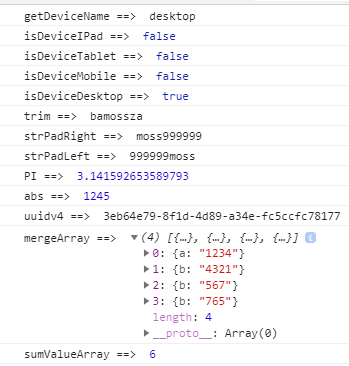

# Bamossza JS Utils


Common script utils for developer.

### Installing

```
npm install bmz-js-utils

or

npm i bmz-js-utils
```

### How to using
#### TypeScript

```
import {BmzJsUtils} from 'bmz-js-utils';

Test: console.log(BmzJsUtils.getDeviceName());
// Result: mobile | tablet | desktop

You will would define aliases.

import {BmzJsUtils as common} from 'bmz-js-utils';

Test: console.log(common.getDeviceName());
// Result: mobile | tablet | desktop
```

#### JavaScript

```
let utils = require('bmz-js-utils').BmzJsUtils;

Test: console.log(utils.getDeviceName());
// Result: mobile | tablet | desktop
```

## Could be use functions

[Wiki functions](https://github.com/bamossza/bmz-js-utils/wiki/functions)

## Examples
```
console.log('getDeviceName ==> ', utils.getDeviceName());
console.log('isDeviceIPad ==> ', utils.isDeviceIPad());
console.log('isDeviceTablet ==> ', utils.isDeviceTablet());
console.log('isDeviceMobile ==> ', utils.isDeviceMobile());
console.log('isDeviceDesktop ==> ', utils.isDeviceDesktop());
console.log('trim ==> ', utils.trim('     bamossza'));
console.log('strPadRight ==> ', utils.strPadRight('moss', 10, '9'));
console.log('strPadLeft ==> ', utils.strPadLeft('moss', 10, '9'));
console.log('PI ==> ', utils.PI());
console.log('abs ==> ', utils.abs(-1245));
console.log('uuidv4 ==> ', utils.uuidv4());
console.log('mergeArray ==> ', utils.mergeArray([{a: '1234'}, {b: '4321'}], [{b: '567'}, {b: '765'}]));
console.log('sumValueArray ==> ', utils.sumValueArray([1, 2, 3]));

Result:
```


## Authors

* **[Panusitt Khuenkham](https://github.com/bamossza)** - *Senior Developer*

See also the list of [contributors](https://github.com/bamossza/bmz-js-utils/contributors) who participated in this project.


##Profiles

* [Bamossza Website](https://bamossza.com)
* [Tool for Developer](https://tool.bamossza.com)
* [Blog Medium](https://medium.com/@bamossza)
* [Stack Overflow](https://stackoverflow.com/users/3863070/bamossza)

## License

MIT License
